# DMS PoC - High Level Architecture

## System Architecture Overview

```mermaid
graph TB
    %% External Actors
    User[👤 User/Client]
    
    %% API Gateway/Load Balancer Layer
    subgraph "API Layer"
        API[🌐 DMS API Server<br/>Express.js + TypeScript<br/>Port: 3000]
    end
    
    %% Application Services
    subgraph "Application Services"
        OCR[🔍 OCR Service<br/>Tesseract.js]
        TextExtract[📄 Text Extraction<br/>PDF-Parse, Mammoth]
        FileProc[⚙️ File Processing<br/>Multer + Validation]
    end
    
    %% Data Storage Layer
    subgraph "Data Storage Layer"
        direction TB
        
        subgraph "File Storage"
            MinIO[🗄️ MinIO<br/>S3-Compatible Storage<br/>Port: 9000/9001]
        end
        
        subgraph "Metadata Storage"
            PostgreSQL[🐘 PostgreSQL<br/>Document Metadata<br/>Port: 5432]
        end
        
        subgraph "Search Engine"
            Elasticsearch[🔎 Elasticsearch<br/>Full-Text Search<br/>Port: 9200]
        end
    end
    
    %% External Integrations
    subgraph "External Tools (Optional)"
        Kibana[📊 Kibana<br/>Data Visualization]
        pgAdmin[🛠️ pgAdmin<br/>DB Management]
    end
    
    %% User Interactions
    User -->|HTTP Requests| API
    
    %% API to Services
    API --> FileProc
    API --> OCR
    API --> TextExtract
    
    %% Services to Storage
    FileProc -->|Store Files| MinIO
    API -->|Save Metadata| PostgreSQL
    API -->|Index Content| Elasticsearch
    
    %% OCR/Text Processing Flow
    OCR -->|Extract Text from Images| API
    TextExtract -->|Extract Text from PDF/DOC| API
    
    %% External Tool Connections
    Elasticsearch -.->|Optional| Kibana
    PostgreSQL -.->|Optional| pgAdmin
    
    %% Styling
    classDef userClass fill:#e1f5fe,stroke:#01579b,stroke-width:2px
    classDef apiClass fill:#f3e5f5,stroke:#4a148c,stroke-width:2px
    classDef serviceClass fill:#e8f5e8,stroke:#1b5e20,stroke-width:2px
    classDef storageClass fill:#fff3e0,stroke:#e65100,stroke-width:2px
    classDef externalClass fill:#fafafa,stroke:#616161,stroke-width:1px,stroke-dasharray: 5 5
    
    class User userClass
    class API apiClass
    class OCR,TextExtract,FileProc serviceClass
    class MinIO,PostgreSQL,Elasticsearch storageClass
    class Kibana,pgAdmin externalClass
```



## Data Flow Architecture


## Container Architecture

```mermaid
graph TB
    subgraph "Docker Environment"
        subgraph "Application Container"
            App[DMS Application<br/>Node.js + Express<br/>Port: 3000]
        end
        
        subgraph "Database Container"
            DB[PostgreSQL<br/>Port: 5432<br/>Volume: postgres_data]
        end
        
        subgraph "Search Container"
            Search[Elasticsearch<br/>Port: 9200<br/>Volume: elasticsearch_data]
        end
        
        subgraph "Storage Container"
            Storage[MinIO<br/>Ports: 9000, 9001<br/>Volume: minio_data]
        end
    end
    
    subgraph "Host System"
        Uploads[uploads/ Directory<br/>Volume Mount]
        Network[Docker Network<br/>dms-network]
    end
    
    %% Container Communications
    App <--> DB
    App <--> Search
    App <--> Storage
    App <--> Uploads
    
    %% Network
    Network --- App
    Network --- DB
    Network --- Search
    Network --- Storage
    
    %% External Access
    External[External Access] --> App
    External --> Storage
    External --> Search
```



## Technology Stack


## Security & Configuration

```mermaid
graph TB
    subgraph "Security Layers"
        ENV[Environment Variables<br/>.env Configuration]
        CORS[CORS Policy<br/>Cross-Origin Control]
        Valid[Input Validation<br/>File Type Checking]
        Auth[Authentication<br/>(Future Enhancement)]
    end
    
    subgraph "Configuration Management"
        Docker[Docker Compose<br/>Service Configuration]
        Network[Internal Networking<br/>Service Discovery]
        Volume[Data Persistence<br/>Volume Mounting]
    end
    
    subgraph "Application Layer"
        API[DMS API Server]
        Services[Application Services]
    end
    
    %% Security to Configuration
    ENV --> Docker
    CORS --> Network
    Valid --> Services
    Auth -.-> API
    
    %% Configuration to Application
    Docker --> API
    Network --> Services
    Volume --> Services
    
    %% Styling
    classDef securityClass fill:#ffebee,stroke:#c62828,stroke-width:2px
    classDef configClass fill:#e8f5e8,stroke:#2e7d32,stroke-width:2px
    classDef appClass fill:#e3f2fd,stroke:#1565c0,stroke-width:2px
    
    class ENV,CORS,Valid,Auth securityClass
    class Docker,Network,Volume configClass
    class API,Services appClass
```

## Deployment Architecture

